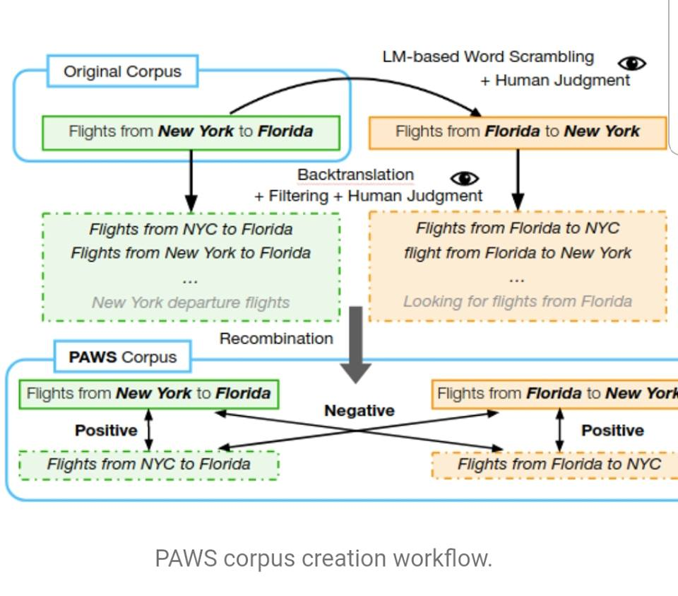
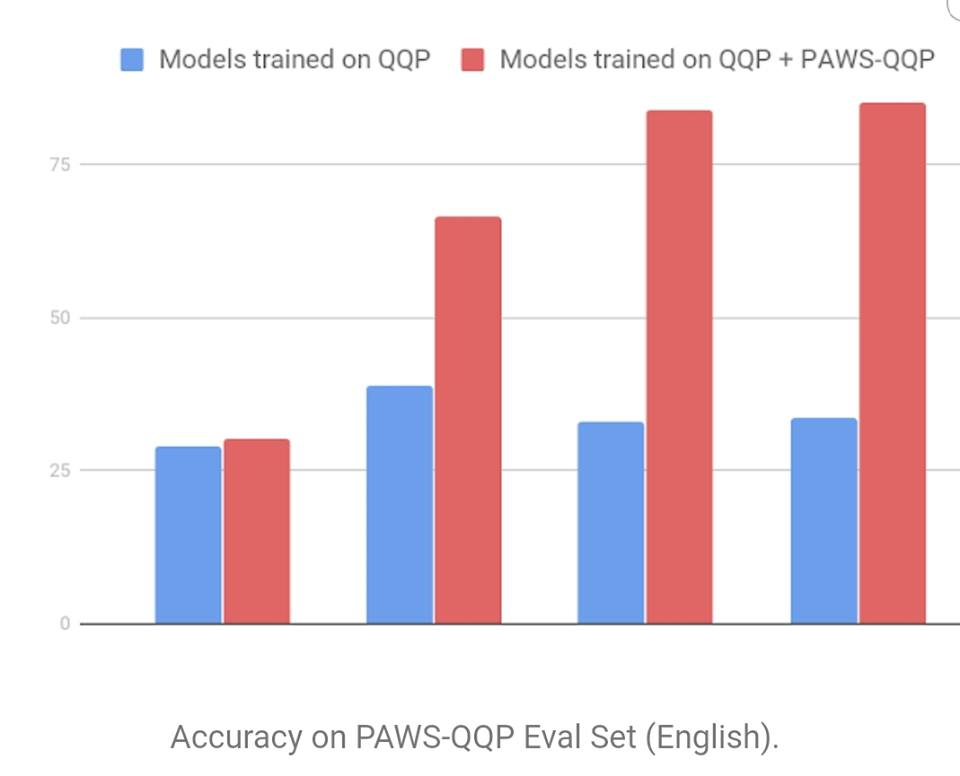

# PAWS-and-PAWS-X-Two-New-Datasets-to-Improve-Natural-Language-Understanding-Models

With PAWS dataset from Google AI, NLP algorithmic accuracy in word order and structure moves from below 50% to 85-89%. 

Now, models can identify if two phrases have the same meaning or not. Check it out.

https://ai.googleblog.com/…/releasing-paws-and-paws-x-two-n…
